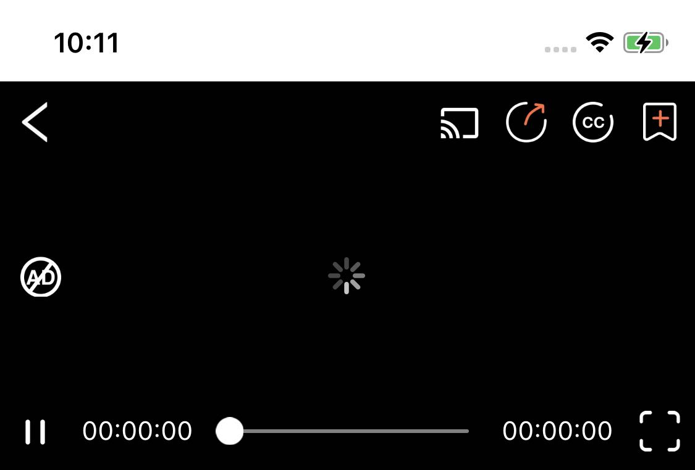
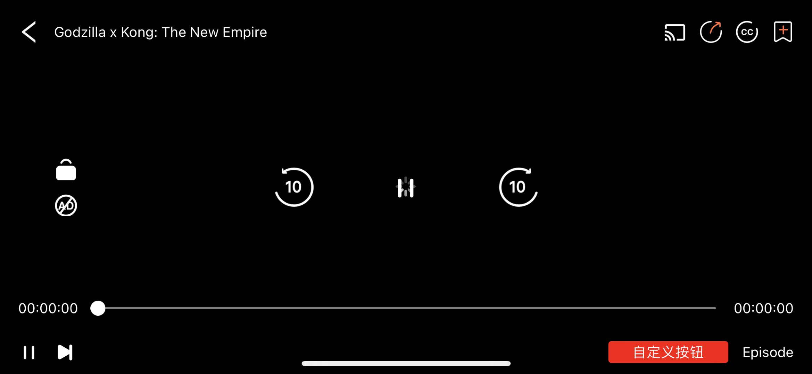

# HTClassPlayer

`HTClassPlayer` 是一个私有的视频播放器控件，支持自定义控制台

## 功能概述

- `HTClassPlayerControl` 播放器+控制层
- `HTClassPlayerControl.var_leftControl` 左侧控制层，Example中使用了Lock和removeAd
- `HTClassPlayerControl.var_rightControl` 右侧控制层，目前未使用
- `HTClassPlayerControl.var_topControl` 顶部控制层，包括 返回、标题、分享、收藏、字幕、投屏等
- `HTClassPlayerControl.var_centerControl` 中间控制层，用于 横屏时显示调整进度和播放暂停
- `HTClassPlayerControl.var_bottomControl` 和其余不同的是，它使用了一个二维数组进行布局，区分竖屏和横屏时的布局样式 包括播放暂停、进度、下一集等




## `HTClassPlayerControlDelegate`（可选实现）
```
@objc public protocol HTClassPlayerControlDelegate: NSObjectProtocol {
    // 按钮点击
    @objc optional func ht_playerControl(var_playerControl: HTClassPlayerControl, var_didClickWith var_model: HTClassPlayerControlModel)
    // 是否正在播放
    @objc optional func ht_playerControl(var_playerControl: HTClassPlayerControl, var_isPlaying: Bool)
    // 播放状态
    @objc optional func ht_playerControl(var_playerControl: HTClassPlayerControl, var_playerStateDidChange var_state: HTEnumPlayerState)
    // 播放时长
    @objc optional func ht_playerControl(var_playerControl: HTClassPlayerControl, var_playTimeDidChange var_currentTime: TimeInterval, var_totalTime: TimeInterval)
    // 缓冲进度
    @objc optional func ht_playerControl(var_playerControl: HTClassPlayerControl, var_loadedTimeDidChange var_loadedDuration: TimeInterval, var_totalTime: TimeInterval)
    // 滑动结束 var_type 0 = slider 1 = 滑动手势
    @objc optional func ht_playerControl(var_playerControl: HTClassPlayerControl, var_sliderChangeEnd var_currentTime: TimeInterval, var_type: Int)
    // 单双击手势 已经处理了播放暂停和显隐控制层 var_tapCount = 1 | 2
    @objc optional func ht_playerControl(var_playerControl: HTClassPlayerControl, var_tapCount: Int)
    // 控制层显隐
    @objc optional func ht_playerControl(var_playerControl: HTClassPlayerControl, var_showControl: Bool)
}
```

## 安装

pod 'HTClassPlayer'

## 使用方法

### 初始化播放器
swift
```
let player = HTClassPlayerControl()
player.var_delegate = self
// 电影循环播放
// 电视剧实现自动切集（HTEnumPlayerState.htEnumPlayerStatePlayToTheEnd）
player.var_isAutoLoop = isMovie
```

### 播放视频
swift
```
if let videoURL = URL(string: "https://highlight-video.cdn.bcebos.com/video/6s/160b95c0-1faa-11ef-8027-6c92bf5b40f4.mp4") {
    player.ht_playVideo(videoURL)
}
```

### 布局播放器视图

swift
```
let isFullScreen = UIScreen.main.bounds.size.width > UIScreen.main.bounds.size.height
if isFullScreen {
    resetControlLayout(isFullscreen: true)
    player.snp.remakeConstraints { make in
        make.edges.equalToSuperview()
    }
} else {
    resetControlLayout(isFullscreen: false)
    player.snp.remakeConstraints { make in
        make.top.equalTo(self.view.safeAreaLayoutGuide.snp.top)
        make.left.right.equalToSuperview()
        make.height.equalTo(self.view.snp.width).multipliedBy(9.0 / 16.0)
    }
}
```

#### 播放和暂停
swift
```
func togglePlayPause() {
    if player.var_isPlaying {
        player.ht_pause()
    } else {
        player.ht_play()
    }
}
```

#### 切换全屏模式
swift
```
func toggleFullscreen() {
    player.ht_fullScreen()
}
```

#### 切换控制按钮状态
swift
```
let subtitleModel = HTClassPlayerControlModel().ht_type(.htEnumControlTypeCC).ht_image("无字幕").ht_selectImage("开字幕"),
```

```
if haveSubtitle {
    subtitleModel.ht_image("有字幕")
} else {
    subtitleModel.ht_image("无字幕")
}
```

```
if openSubtitle {
    subtitleModel.ht_setSelected(true)
} else {
    subtitleModel.ht_setSelected(false)
}
```

### 控制器布局
swift
```
func resetControlLayout(isFullscreen: Bool) {
    if isLock {
        // 锁屏模式
        player.var_leftControl.ht_reloadData([
            HTClassPlayerControlModel().ht_type(.htEnumControlTypeLock).ht_image(ht_image(182)).ht_selectImage(ht_image(183)).ht_setSelected(true)
        ])
        player.var_topControl.ht_reloadData([])
        player.var_centerControl.ht_reloadData([])
        player.var_bottomControl.ht_reloadData([[]])
    } else if isFullscreen {
        // 全屏模式
        player.var_topControl.ht_reloadData([
            HTClassPlayerControlModel().ht_type(.htEnumControlTypeBack).ht_image("返回"),
            HTClassPlayerControlModel().ht_type(.htEnumControlTypeTitle).ht_title("标题"),
            HTClassPlayerControlModel().ht_type(.htEnumControlTypeSpacer), // 定义为空白区域，自适应宽度，加入它才能让下方按钮靠右显示
            HTClassPlayerControlModel().ht_type(.htEnumControlTypeCast).ht_image("投屏"),
            HTClassPlayerControlModel().ht_type(.htEnumControlTypeShare).ht_image("分享"),
            subtitleModel, //字幕按钮、保存下来使用
            HTClassPlayerControlModel().ht_type(.htEnumControlTypeCollection).ht_image("收藏")
        ])
        // 二维数组，用于区分横竖屏不同的UI样式
        player.var_bottomControl.ht_reloadData([
            [
                HTClassPlayerControlModel().ht_type(.htEnumControlTypeProgress)
            ],
            [
                HTClassPlayerControlModel().ht_type(.htEnumControlTypePlayPause).ht_image("播放").ht_selectImage("暂停").ht_setSelected(player.var_isPlaying),
                HTClassPlayerControlModel().ht_type(.htEnumControlTypeNextEpisode).ht_image("下一集"),
                HTClassPlayerControlModel().ht_type(.htEnumControlTypeSpacer),
                HTClassPlayerControlModel().ht_type(.htEnumControlTypeEpisodes).ht_title("选集")
            ]
        ])
        player.var_leftControl.ht_reloadData([
            HTClassPlayerControlModel().ht_type(.htEnumControlTypeLock).ht_image("未锁").ht_selectImage("已锁"),
            HTClassPlayerControlModel().ht_type(.htEnumControlTypeRemoveAd).ht_image("移除广告")
        ])
        player.var_centerControl.ht_reloadData([
            HTClassPlayerControlModel().ht_type(.htEnumControlTypeBackward).ht_image("-10s").ht_size(CGSize(width: 40, height: 40)),
            HTClassPlayerControlModel().ht_type(.htEnumControlTypeFullScreenPlayPause).ht_image("播放").ht_selectImage("暂停").ht_size(CGSize(width: 44, height: 44)).ht_setSelected(player.var_isPlaying),
            HTClassPlayerControlModel().ht_type(.htEnumControlTypeForward).ht_image("+10s").ht_size(CGSize(width: 40, height: 40))
        ])
    } else {
        // 非全屏模式
        player.var_topControl.ht_reloadData([
            HTClassPlayerControlModel().ht_type(.htEnumControlTypeBack).ht_image("返回"),
            HTClassPlayerControlModel().ht_type(.htEnumControlTypeSpacer),
            HTClassPlayerControlModel().ht_type(.htEnumControlTypeCast).ht_image("投屏"),
            HTClassPlayerControlModel().ht_type(.htEnumControlTypeShare).ht_image("分享"),
            subtitleModel,
            HTClassPlayerControlModel().ht_type(.htEnumControlTypeCollection).ht_image("收藏")
        ])
        player.var_bottomControl.ht_reloadData([
            [
                HTClassPlayerControlModel().ht_type(.htEnumControlTypePlayPause).ht_image("播放").ht_selectImage("暂停").ht_setSelected(player.var_isPlaying),
                HTClassPlayerControlModel().ht_type(.htEnumControlTypeProgress),
                HTClassPlayerControlModel().ht_type(.htEnumControlTypeFullscreen).ht_image("全屏")
            ]
        ])
        player.var_leftControl.ht_reloadData([
            HTClassPlayerControlModel().ht_type(.htEnumControlTypeRemoveAd).ht_image("移除广告")
        ])
        player.var_centerControl.ht_reloadData([])
    }
}
```
